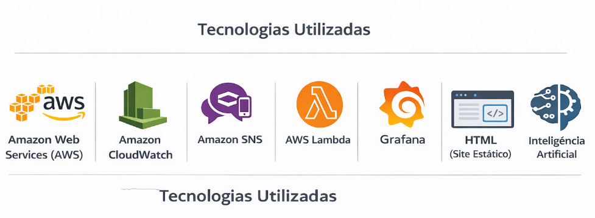
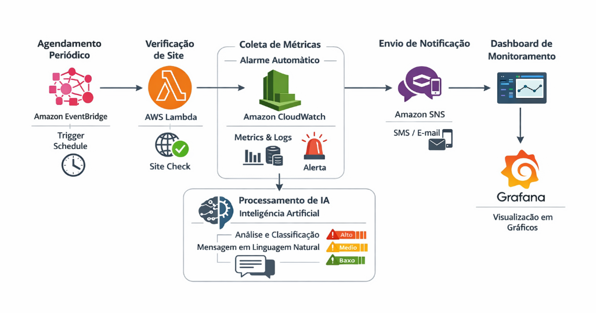

# 🚀 Projeto Final – AWS re/Start | Monitoramento de Disponibilidade com Observabilidade e IA



## 📌 Visão Geral

Este projeto implementa um **sistema de monitoramento de disponibilidade de um site**, utilizando **AWS CloudWatch, Alarmes, Grafana e Inteligência Artificial**, com foco educacional e aplicação prática em cenários reais de mercado.

O objetivo é **detectar falhas automaticamente**, gerar **alertas inteligentes** e **visualizar métricas em tempo real**, aplicando conceitos de **Cloud Computing, Observabilidade e IA**.

---

## 🎓 Curso e Orientação

- **Curso:** AWS re/Start  
- **Professor:** Anderson Garcia Albuquerque  
- **Módulo:** Primeiro Módulo – Projeto Final  
- **Grupo:** 04  

### 👥 Integrantes
- Cleison Silva Dos Santos  
- Guido Eduardo Tavares  
- Leandro Vieira Goulart  
- Marco Matheus Mira Machado  
- Otávio Vinícius Cruz Da Silva  
- Rodrigo De Carvalho Pelegrino  

---

## 🧠 Metodologia de Organização (SCRUM)

O projeto foi organizado utilizando a metodologia ágil **SCRUM**, com o objetivo de:

- Dividir responsabilidades entre os integrantes  
- Planejar atividades em etapas claras  
- Garantir entregas incrementais  
- Facilitar o acompanhamento da evolução do projeto  

O SCRUM foi utilizado como **estrutura organizacional**, não como ferramenta de desenvolvimento de software complexo, respeitando o caráter educacional do projeto.

---

## 🎯 Problema que o Projeto Resolve

Sistemas digitais precisam estar disponíveis **24 horas por dia, 7 dias por semana**.

Quando um site sai do ar e **não existe monitoramento**:
- Usuários não conseguem acessar
- Vendas podem ser perdidas
- A falha só é percebida quando alguém reclama

👉 **Sem monitoramento, não existe reação rápida.**

Este projeto resolve esse problema criando um **sistema automático de monitoramento e alerta**.

---

## 🔍 Conceito-Chave: Observabilidade

Observabilidade é a capacidade de entender o que está acontecendo em um sistema **em tempo real**, baseada em três pilares:

- **Métricas:** dados numéricos (disponibilidade, tempo de resposta)
- **Logs:** registros detalhados de eventos
- **Alertas:** notificações automáticas de falhas

Sem observabilidade, o sistema fica “cego”.  
Este projeto aplica esses conceitos na prática.

---

## 🎯 Objetivo Geral

Desenvolver um sistema de monitoramento de disponibilidade de um site utilizando serviços da AWS e a ferramenta Grafana, permitindo o acompanhamento em tempo real e a geração automática de alertas em caso de falhas.

---

## 🎯 Objetivos Específicos

- Criar um site estático simples para testes  
- Hospedar o site em ambiente acessível pela internet  
- Coletar métricas de disponibilidade  
- Criar alarmes automáticos na AWS  
- Integrar métricas ao Grafana  
- Criar dashboards de monitoramento  
- Simular a queda do site  
- Validar o envio de alertas  

---

## 🧱 Arquitetura da Solução

Fluxo simplificado do sistema:

```
EventBridge (Agendamento)
↓
AWS Lambda (Teste de disponibilidade)
↓
CloudWatch (Métricas e Logs)
↓
IA (Classificação e análise)
↓
Alarmes
↓
SNS (Notificação)
↓
Grafana (Dashboard)
```


A Inteligência Artificial atua na **análise de padrões**, **classificação de gravidade** e **tradução técnica para linguagem natural**.

---

## 🤖 Uso de Inteligência Artificial no Projeto

A IA é aplicada para:

- Identificar padrões anormais nas métricas
- Classificar a gravidade da falha (baixa, média, crítica)
- Gerar mensagens de alerta em linguagem natural
- Sugerir ações iniciais de resposta
- Apoiar a tomada de decisão técnica

Exemplo de alerta inteligente:

> ⚠️ **Gravidade: Alta**  
> O site está indisponível há mais de 3 minutos.  
> Possível falha no serviço HTTP.  
> **Ação recomendada:** verificar conectividade e status do serviço hospedado.

---

## 🛠️ Tecnologias Utilizadas

- **Amazon Web Services (AWS):** infraestrutura em nuvem  
- **Amazon CloudWatch:** coleta de métricas, logs e alarmes  
- **Amazon SNS:** envio de notificações  
- **AWS Lambda:** execução de verificações automatizadas  
- **Grafana:** visualização de métricas em tempo real  
- **HTML (Site Estático):** objeto de teste  
- **Inteligência Artificial:** análise de padrões e geração de alertas inteligentes  

---

## 📊 Resultados Esperados

Ao final do projeto, espera-se:

- Site acessível externamente  
- Monitoramento automático funcionando  
- Alarmes acionados corretamente  
- Dashboard exibindo disponibilidade e status  
- Simulação de falha validada  
- Alerta enviado automaticamente  

👉 **O sistema cai → o alerta dispara → o problema é identificado.**

---

## 🎓 Ganho Técnico para o Aluno

O projeto proporciona experiência prática em:

- Cloud Computing  
- Observabilidade  
- Monitoramento de infraestrutura  
- Métricas e alarmes  
- Integração de serviços AWS  
- Visualização de dados  
- Aplicação de IA em ambientes de monitoramento  

Experiência real de mercado, não apenas teórica.

---

## 🌍 Aplicação no Mundo Real

Esse tipo de solução é utilizada em:

- Bancos  
- E-commerces  
- Hospitais  
- Sistemas governamentais  
- Aplicações web  
- Empresas de tecnologia  

Monitoramento não é opcional. É padrão de mercado.

---

## ✅ Status do Projeto

📌 Em desenvolvimento  
📌 Projeto educacional com foco prático  
📌 Totalmente executável em conta AWS de estudo  

---

## 📎 Observação Final

Este projeto foi desenvolvido com foco educacional, seguindo boas práticas de mercado, respeitando limitações de ambiente de estudo e alinhado às diretrizes do curso **AWS re/Start**.

